<p align="center">
  
</p>

<h1 align="center">Lydex</h1>

<p align="center">
  
  
  
</p>

Lydex is a Markdown-first site engine for small structured websites. It lets one project root hold page copy, structured blocks, detail-page Markdown, query-driven cross-page lists, template overrides, and theme assets without introducing a database or a heavy CMS layer.

Lydex can run in two modes:

- a small Node/Express server for local preview and optional admin editing
- a static exporter that writes `index.html` files you can publish anywhere

## Table Of Contents

- [What Lydex Is Good At](#what-lydex-is-good-at)
- [Requirements](#requirements)
- [Install](#install)
- [Create A Project](#create-a-project)
- [Quick Start](#quick-start)
- [How Lydex Thinks About Content](#how-lydex-thinks-about-content)
- [Configuration Reference](#configuration-reference)
- [Templates](#templates)
- [Themes](#themes)
- [API](#api)
- [CLI](#cli)
- [Build Publish And Rollback](#build-publish-and-rollback)
- [Admin Editing](#admin-editing)
- [Example Site Walkthrough](#example-site-walkthrough)
- [Package Structure](#package-structure)
- [Testing](#testing)
- [Current Limitations](#current-limitations)

## What Lydex Is Good At

- Keeping content in Markdown files instead of moving it into a database
- Rendering structured block declarations inside normal page Markdown
- Letting block items open dedicated detail routes backed by their own Markdown files
- Reusing indexed content across pages with `:::query`
- Separating shell, block, detail, query, and theme overrides cleanly
- Supporting both local preview and static export from the same content model

Lydex is a good fit when you want more structure than a plain Markdown site, but you do not want to build a full low-code system.

## Requirements

- Node.js `>=18`
- npm that ships with your Node installation

No database is required. No environment variables are required for the default preview flow.

## Install

```bash
npm install @lydex/lydex
```

## Create A Project

Use the interactive scaffolder to generate a full Lydex example site as a starting point:

```bash
npm create lydex@latest
```

or:

```bash
pnpm create lydex
```

The scaffolder asks for:

- project name
- theme preset

Right now it ships the `default` preset, which writes the bundled example site into your new project directory. The project content keeps the built-in `Lydex` copy; your chosen project name is used for the directory and generated project metadata.

## Quick Start

This section builds the smallest useful Lydex site from scratch.

### 1. Create A Site Folder

```text
my-site/
  lydex.config.js
  content/
    home.md
    news.md
    news/
      lydex-site-launched.md
  assets/
    _pages_/
      home/
        cover.jpg
    news/
      lydex-site-launched/
        cover.jpg
```

### 2. Add `lydex.config.js`

This config uses built-in templates and the built-in theme. You only need to declare custom template paths when you want to override them.

```js
module.exports = {
  site: {
    siteName: 'My Lab Site',
    siteSubtitle: 'Markdown-first research notes',
    footerText: '© 2026 My Lab Site',
  },
  pages: {
    home: {
      route: '/',
      source: 'content/home.md',
    },
    news: {
      route: '/news',
      source: 'content/news.md',
    },
  },
  blocks: {
    news: {
      template: 'cardGrid',
      fields: {
        title: { type: 'string', required: true },
        publishedAt: { type: 'string', required: true },
        category: { type: 'string', required: false },
      },
      hasDetailPage: true,
      contentDir: 'content/news',
      slugField: '_slug_',
      slugSourceField: 'title',
      route: '/news/:slug',
      detailTemplate: 'standardDetail',
    },
  },
};
```

### 3. Add A Homepage

`content/home.md`

```md
---
title: Home
eyebrow: Lydex Demo
lead: A tiny site powered by Markdown pages, blocks, and detail routes.
---

Welcome to the site.

:::query
from: news
sort: publishedAt:desc
limit: 3
template: compactList
:::
```

### 4. Add A Source Page With Structured Blocks

`content/news.md`

```md
---
title: News
lead: Updates indexed by Lydex.
---

:::news
_id_: id-news-launch
title: Lydex Site Launched
publishedAt: 2026-04-04
category: Release
:::
```

### 5. Add The Detail Markdown File

`content/news/lydex-site-launched.md`

```md
This detail page is matched by the title-derived slug.
```

At runtime, Lydex derives `lydex-site-launched` from `title`, then matches:

- `content/news/lydex-site-launched.md`
- `assets/news/lydex-site-launched/cover.*`
- `/news/lydex-site-launched`

`_id_` is the stable system identity for the entry. `_slug_` is the routed path key. If you omit `_slug_`, Lydex derives it from `slugSourceField`.

### 6. Start The Preview Server

```bash
npx lydex --root ./my-site --port 3001
```

Open `http://127.0.0.1:3001`.

### 7. Build Static HTML

```bash
npx lydex --build --root ./my-site --out ./dist
```

Lydex will emit:

- `dist/index.html` for the homepage
- `dist/news/index.html` for the list page
- `dist/news/lydex-site-launched/index.html` for the detail page
- `dist/assets/*` for your project assets
- `dist/__lydex/theme/*` for the resolved theme assets

## How Lydex Thinks About Content

### 1. Pages

A page maps one route to one Markdown file:

```js
pages: {
  news: {
    route: '/news',
    source: 'content/news.md',
  },
}
```

Page Markdown does two jobs:

- frontmatter sets shell-level values such as `title`, `eyebrow`, `lead`, and optional hero media
- the body holds normal text plus block declarations and query declarations

If `heroImage` is omitted, Lydex looks for `assets/_pages_/<page-slug>/cover.*`.

### 2. Blocks

Blocks are structured items embedded inside a page:

```md
:::news
title: Lydex Site Launched
publishedAt: 2026-04-04
category: Release
:::
```

Each block type must be declared in `blocks` inside `lydex.config.js`. Lydex validates block fields against that declaration.

### 3. Detail Pages

When a block has `hasDetailPage: true`, Lydex expects a second Markdown file inside `contentDir`.

For this config:

```js
news: {
  hasDetailPage: true,
  contentDir: 'content/news',
  slugField: '_slug_',
  slugSourceField: 'title',
  route: '/news/:slug',
  detailTemplate: 'standardDetail',
}
```

This block:

```md
:::news
_id_: id-news-launch
title: Lydex Site Launched
publishedAt: 2026-04-04
:::
```

must have:

```text
content/news/lydex-site-launched.md
```

Important rules:

- `_id_` and `_slug_` are reserved system fields
- `slugField` should point at `_slug_` for the managed-slug workflow
- if `_slug_` is absent, `slugSourceField` can derive it from another field such as `title`
- if `_slug_` is present, Lydex uses it after normalization
- when `slugSourceField` is set, Lydex normalizes the source value to lowercase letters and `-`
- Chinese titles are transliterated to pinyin before normalization
- the detail filename and detail asset directory must exactly match the derived slug
- `_pages_` is reserved for first-level page assets and cannot be used as a block name
- detail frontmatter overrides colliding list-block fields
- detail templates receive merged list fields, detail frontmatter, and `bodyHtml`

### 3.1 Editing Managed Entries

For detail-enabled blocks that use `_id_` / `_slug_`:

- keep `_id_` stable; Lydex uses it to recognize the same entry across preview/build runs
- if `_slug_` is omitted, changing `slugSourceField` data such as `title` renames the detail Markdown path, asset directory, and route on the next preview/build
- if `_slug_` is present, changing `title` does not move the route; the explicit `_slug_` wins
- if you change `_slug_` explicitly, Lydex treats that as a route/path rename and moves the matching detail Markdown file and asset directory on the next preview/build
- if you delete a block declaration, the old detail Markdown file and asset directory become orphaned; Lydex lists them and asks before deleting them

### 3.2 Implicit Vs Explicit `_slug_`

Implicit `_slug_` means the route key is derived from `slugSourceField`:

```md
:::news
_id_: id-news-launch
title: Lydex Site Launched
publishedAt: 2026-04-04
:::
```

With `slugSourceField: 'title'`, this resolves to:

- route: `/news/lydex-site-launched`
- detail doc: `content/news/lydex-site-launched.md`
- assets: `assets/news/lydex-site-launched/`

Explicit `_slug_` means the route key is pinned even if `title` changes:

```md
:::news
_id_: id-news-launch
_slug_: launch-2026
title: Lydex Site Launched
publishedAt: 2026-04-04
:::
```

This resolves to:

- route: `/news/launch-2026`
- detail doc: `content/news/launch-2026.md`
- assets: `assets/news/launch-2026/`

The bundled example site includes a real pinned-route entry at `/queries/release-notes-2026`, backed by `example/content/news/release-notes-2026.md`.

Editing consequences:

- change `title` only on the implicit form -> Lydex derives a new `_slug_` on the next preview/build
- change `title` only on the explicit form -> route and file paths stay unchanged
- change `_slug_` on the explicit form -> Lydex moves the matching detail doc and asset directory on the next preview/build

### 3.3 Recommended Authoring Habits

Use these defaults unless you have a specific routing reason not to:

- write `_id_` once and keep it stable forever
- omit `_slug_` for normal entries and let Lydex derive it from `slugSourceField`
- write `_slug_` explicitly only when you want to pin a route or filename
- change `title` freely when `_slug_` is explicit; the public path stays stable
- expect title changes to move the route only when `_slug_` is implicit
- treat `_slug_` edits as path changes, not copy edits

Recommended pattern for most entries:

```md
:::news
_id_: id-news-launch
title: Lydex Site Launched
publishedAt: 2026-04-04
category: Release
:::
```

Recommended pattern when the URL must stay fixed:

```md
:::news
_id_: id-news-launch
_slug_: launch-2026
title: Lydex Site Launched
publishedAt: 2026-04-04
category: Release
:::
```

### 4. Queries

Queries let one page render another page's indexed block items:

```md
:::query
from: news
sort: publishedAt:desc
limit: 3
template: compactList
:::
```

Supported concepts:

- `from`: block type to query
- `sort`: `field:asc` or `field:desc`
- `limit`: max number of items
- `offset`: pagination offset
- `where`: JSON condition object
- `template`: query template key

Example with filtering:

```md
:::query
from: news
where: {"all":[{"field":"category","op":"eq","value":"Release"}]}
sort: publishedAt:desc
limit: 5
template: compactList
:::
```

The queried items can still keep their original list page and detail routes. A query is an alternate view over indexed content, not a content clone.

### 5. Detail Pagination

If a detail-enabled block type also sets `enablePagination: true`, Lydex builds previous/next links for its detail pages.

```js
feature: {
  hasDetailPage: true,
  enablePagination: true,
  // ...
}
```

You can optionally add a reserved `page` field on block declarations for pagination order:

```md
:::feature
title: Markdown First
page: 1
:::
```

Ordering rules:

- if no item in that block type declares `page`, Lydex uses page-key order, then declaration order
- items with explicit `page` values are ordered numerically
- if multiple pages overlap on the same `page` range, Lydex groups by page key and keeps stable ordering within each group
- items without `page` are appended after the last explicit cluster for their page, in declaration order

That gives you a global detail-page sequence across multiple source pages without inventing a separate routing layer.

## Configuration Reference

The main entry point is `lydex.config.js`.

### Top-Level Keys

| Key | Purpose |
| --- | --- |
| `site` | Site-wide shell values such as title, subtitle, footer text |
| `pages` | Route to Markdown page mapping |
| `blocks` | Block type definitions and detail-route contracts |
| `templates` | Custom template path map |
| `queryTemplates` | Custom query template path map |
| `theme` | Theme directory and asset overrides |

### `site`

Example:

```js
site: {
  siteName: 'Lydex',
  siteSubtitle: 'Declarative Markdown Site Engine',
  footerText: '© 2026 Lydex',
}
```

These values are available to the page shell template.

### `pages`

Example:

```js
pages: {
  home: {
    route: '/',
    source: 'content/home.md',
  },
  docs: {
    route: '/docs',
    source: 'content/docs.md',
  },
}
```

Rules:

- page keys must be unique
- routes must be unique
- page source paths are resolved relative to `rootDir`

### `blocks`

Example:

```js
blocks: {
  feature: {
    template: 'featureCard',
    fields: {
      title: { type: 'string', required: true },
      summary: { type: 'string', required: true },
    },
    hasDetailPage: true,
    contentDir: 'content/features',
    slugField: '_slug_',
    slugSourceField: 'title',
    route: '/features/:slug',
    detailTemplate: 'featureDetail',
  },
}
```

Block rules:

- every used block type must exist in `blocks`
- every declared field used in Markdown must be listed in `fields`
- missing required fields throw during index build
- undeclared fields throw during index build
- `_id_`, `_slug_`, and other `_xx_` names are reserved for system-managed fields and must not be declared in `fields`
- if `hasDetailPage: true`, then `contentDir`, `slugField`, `route`, and `detailTemplate` are required
- `slugSourceField` is optional and lets Lydex derive the routed slug from a field such as `title`
- detail routes must include `:slug`

### Built-In Defaults

If you do not override them, Lydex provides:

- page shell: `templates/page-shell.html`
- block template key: `cardGrid`
- detail template key: `standardDetail`
- query template key: `compactList`
- theme files: `theme/base.css`, `theme/components.css`, `theme/app.js`

That means a small project can start with built-in resources and only override the parts it actually wants to customize.

## Templates

Lydex uses four template layers:

- `page-shell`: the shared outer page chrome, including `<head>`, navigation, footer, and the main content frame
- `block`: the template for a block declaration rendered inside a page body
- `detail`: the template for a detail-enabled block's routed second-level page
- `query`: the template for a query result view rendered from indexed content

### Built-In Template Paths

The package ships these built-ins:

- page shell: `templates/page-shell.html`
- block template: `templates/blocks/card-grid.html`
- detail template: `templates/details/standard-detail.html`
- query template: `templates/query/compact-list.html`

### Custom Template Example

```js
templates: {
  pageShell: 'templates/page-shell.html',
  featureCard: 'templates/blocks/feature-card.html',
  featureDetail: 'templates/details/feature-detail.html',
},
queryTemplates: {
  homepageNews: 'templates/query/homepage-news.html',
},
```

Then reference those keys from block declarations:

```js
feature: {
  template: 'featureCard',
  detailTemplate: 'featureDetail',
}
```

### Template Features

Supported rendering features are intentionally small:

- `{{field}}` for escaped values
- `{{{htmlField}}}` for raw HTML values
- `{{#items}}...{{/items}}` for repeating arrays

Useful context values:

- detail templates receive merged list fields + detail frontmatter + `bodyHtml`
- detail-enabled block templates receive `detailRoute`
- query items can use source fields plus `detailRoute`
- the page shell receives `contentHtml`, shell-level site fields, and theme asset HTML

### Shell Theme Injection

Modern shells should use:

- `{{{themeStylesheetsHtml}}}`
- `{{{themeScriptHtml}}}`

Older shells can still use:

- `{{themeCssHref}}`
- `{{themeJsSrc}}`

## Themes

Lydex themes are file-based. The recommended split is:

```text
theme/
  theme.json
  base.css
  components.css
  app.js
```

Recommended responsibility split:

- `base.css`: page-level foundations such as body, typography, headings, links, tables, and reading rhythm
- `components.css`: block cards, query lists, detail layouts, and other reusable pieces
- `app.js`: optional theme behavior

### `theme.json`

Example:

```json
{
  "name": "Songlab Light",
  "author": "Example Author",
  "version": "1.0.0",
  "description": "A light editorial theme for Lydex",
  "baseCss": "base.css",
  "componentsCss": "components.css",
  "appJs": "app.js"
}
```

All fields are optional. When present, they must be strings.

### Theme Config In `lydex.config.js`

```js
theme: {
  directory: 'assets/public',
  baseCss: 'base.css',
  componentsCss: 'components.css',
  appJs: 'app.js',
}
```

Priority order:

1. Lydex defaults
2. `theme/theme.json`
3. `theme` overrides from `lydex.config.js`

Legacy compatibility:

- if `base.css` and `components.css` are absent but `site.css` exists, Lydex falls back to `site.css`

## API

```js
const {
  buildSite,
  createApp,
  listPublishHistory,
  publishSite,
  rollbackSite,
  startServer,
} = require('@lydex/lydex');
```

### `createApp(options)`

Creates an Express-compatible app.

Common options:

- `rootDir`
- `config`
- `adminUser`
- `adminPassword`
- `adminPath`

### `startServer(options)`

Starts the preview server and returns the Node server instance.

Common options:

- `rootDir`
- `port`
- `host`
- `config`
- `adminUser`
- `adminPassword`
- `adminPath`

### `buildSite(options)`

Builds static HTML to disk.

Common options:

- `rootDir`
- `outDir`
- `config`

### `publishSite(options)`

Builds the site, snapshots the existing target if needed, and copies the build into the publish target.

Common options:

- `rootDir`
- `targetDir`
- `historyDir`
- `outDir`
- `config`

### `rollbackSite(options)`

Restores one publish-history snapshot into the target directory.

Common options:

- `rootDir`
- `targetDir`
- `historyDir`
- `rollbackId`

### `listPublishHistory(options)`

Returns publish-history entries, optionally filtered by `targetDir`.

## CLI

Basic preview:

```bash
npx lydex --root ./example --port 3001 --host 127.0.0.1
```

Before preview or static build, Lydex creates any missing managed detail files and asset folders, writes generated `_id_` values back into managed block declarations when needed, and asks before deleting orphaned managed detail files or asset directories.

### Supported Flags

| Flag | Meaning |
| --- | --- |
| `--build` | Build static output |
| `--publish` | Build then publish into a target directory |
| `--list-history` | Print publish history JSON |
| `--rollback <publishId>` | Restore one history entry |
| `--root <dir>` | Site root directory |
| `--out <dir>` | Build output directory |
| `--target <dir>` | Publish target directory |
| `--history-dir <dir>` | Custom publish-history directory |
| `--port <number>` | Preview server port |
| `--host <host>` | Preview server host |
| `--config <file>` | Config filename under the site root |
| `--admin-path <path>` | Custom admin path |

Unknown flags, missing values, and invalid `--port` values fail fast with a non-zero exit code.

When a CLI command returns a plain object, Lydex prints it as JSON. That applies to build, publish, rollback, and history commands.

## Build Publish And Rollback

### Build

```bash
lydex --build --root ./example --out ./dist
```

Output rules:

- page routes are written as `index.html` under their route path
- detail routes are also emitted as `index.html`
- the project `assets/` directory is copied to `dist/assets`
- the resolved theme directory is copied to `dist/__lydex/theme`

### Publish

```bash
lydex --publish --root ./example --target ./published
```

Behavior:

- build output defaults to `.lydex/build`
- if the target directory already exists, Lydex snapshots it into `.lydex/publish-history/<publishId>/site`
- each history entry also stores `meta.json`

### List History

```bash
lydex --list-history --root ./example --target ./published
```

### Rollback

```bash
lydex --rollback 20260404T120000123Z --root ./example --target ./published
```

Rollback behavior:

- Lydex restores the selected snapshot back into the target directory
- before restore, Lydex snapshots the current target as a `rollback-backup` entry

## Admin Editing

Admin editing is optional and only available in server mode.

Enable it by passing credentials into `createApp()` or `startServer()`:

```js
startServer({
  rootDir: process.cwd(),
  adminUser: 'admin',
  adminPassword: 'secret',
  adminPath: '/manage',
});
```

Available routes:

- `GET /admin` by default, or `GET <adminPath>`
- `GET <adminPath>/api/files?dir=content`
- `GET <adminPath>/api/file?path=content/example.md`
- `PUT <adminPath>/api/file?path=content/example.md`
- `GET <adminPath>/api/assets`

Rules:

- admin file access is limited to `content/` and `assets/`
- successful content writes rebuild the in-memory index immediately
- admin editing is still file-oriented; it does not provide a separate UI flow for creating or renaming detail entries
- server mode reflects edits immediately after save
- static builds do not update automatically; you must run build or publish again

## Example Site Walkthrough

This repository ships a full example site under [example/](example/).

Run it locally:

```bash
npx lydex --root ./example --port 3001
```

The example is intentionally organized as documentation:

- `/` shows syntax on the page and then renders those same declarations
- `/concepts` explains the content model
- `/design` explains project structure and runtime choices
- `/blocks` explains structured block declarations and pagination order
- `/details` explains detail-file matching and field override behavior
- `/queries` explains query blocks
- `/theme` explains the theme split and asset ownership

Useful example files:

- config: [example/lydex.config.js](example/lydex.config.js)
- homepage: [example/content/home.md](example/content/home.md)
- block tutorial page: [example/content/blocks.md](example/content/blocks.md)
- query source page: [example/content/news.md](example/content/news.md)
- feature detail doc: [example/content/features/markdown-first.md](example/content/features/markdown-first.md)
- shell template: [example/templates/page-shell.html](example/templates/page-shell.html)
- theme base: [example/assets/public/base.css](example/assets/public/base.css)
- theme components: [example/assets/public/components.css](example/assets/public/components.css)
- theme behavior: [example/assets/public/app.js](example/assets/public/app.js)

## Package Structure

```text
bin/
  lydex.js                # CLI entry
src/
  build/                  # Static export
  cli/                    # CLI parsing and dispatch
  config/                 # Defaults and config loading
  content/                # Markdown loading and indexing
  publish/                # Publish, rollback, history
  query/                  # Query execution
  render/                 # Template rendering
  runtime/                # Shared runtime creation
  server/                 # Express app and route registration
  theme/                  # Theme manifest and asset resolution
  utils/                  # Shared errors and helpers
templates/
  ...                     # Built-in templates
theme/
  ...                     # Built-in theme
example/
  ...                     # Full teaching/demo site
test/
  ...                     # Automated coverage
```

## Testing

Run all tests:

```bash
npm test
```

Run lint:

```bash
npm run lint
```

Useful local checks while working on the scaffolder:

```bash
node packages/create-lydex/bin/create-lydex.js
npm pack --dry-run --prefix packages/create-lydex
```

The test suite covers:

- config loading
- content indexing
- query execution
- page and detail rendering
- static build
- publish and rollback
- CLI behavior
- example site contracts

## Current Limitations

The current Markdown body renderer is intentionally small.

Today Lydex does not implement a full Markdown parser for page and detail body copy. Body content currently supports escaped paragraphs plus fenced code blocks, but features such as headings, lists, tables, inline links, and broader inline Markdown syntax are not yet parsed from body text.

That means:

- frontmatter is supported
- block declarations are supported
- query declarations are supported
- fenced code blocks are supported
- raw HTML is escaped in normal Markdown body content

If you need richer body rendering, that should be added as an explicit engine capability rather than being assumed silently.


